<!-- HEADER -->

  
  
  

---

## 🧑‍💻 About Me

Desarrollador de aplicaciones web y móviles con sede en **Málaga, España**. Me apasiona construir soluciones completas — desde APIs REST con Spring Boot y Node.js, hasta interfaces interactivas con React y aplicaciones nativas con Kotlin y Flutter.

- 🔭 Trabajo con el stack completo: **frontend, backend, bases de datos y despliegue**
- 🐳 Experiencia en contenedorización con **Docker** y servicios en la nube con **AWS**
- 🌱 Siempre aprendiendo y compartiendo conocimiento a través de mis repositorios

---

## 🛠️ Tech Stack

### Languages

### Frontend

### Backend & Databases

### DevOps & Tools

---

## 🚀 Featured Projects

<table>
<tr>
<td width="50%" valign="top">

### [📚 book-social-network](https://github.com/andresito87/book-social-network)
Red social para el préstamo de libros. Proyecto full-stack con gestión de usuarios, catálogo y sistema de préstamos.

`TypeScript`

</td>
<td width="50%" valign="top">

### [🐳 SpringBootApp-Dockerizada](https://github.com/andresito87/SpringBootApp-Dockerizada)
Aplicación Spring Boot containerizada con Docker. Ejemplo de arquitectura backend lista para producción.

`Java` `Docker` `Spring Boot`

</td>
</tr>
<tr>
<td width="50%" valign="top">

### [🎮 GamingApp](https://github.com/andresito87/GamingApp)
Aplicación móvil Android desarrollada con Kotlin y Jetpack Compose, demostrando desarrollo nativo moderno.

`Kotlin` `Jetpack Compose`

</td>
<td width="50%" valign="top">

### [📱 Curso-React-Native](https://github.com/andresito87/Curso-React-Native)
Proyectos y ejercicios de React Native para desarrollo móvil multiplataforma.

`TypeScript` `React Native`

</td>
</tr>
</table>

---

## 📊 GitHub Stats

<!-- Stats y Top Languages se generan como SVGs estáticos via GitHub Actions -->
<!-- Ver .github/workflows/grs.yml — se actualizan diariamente a las 3:00 AM UTC -->
<!-- Streak Stats usa streak-stats.demolab.com (servicio externo fiable) -->

  
  

  

---

  <i>Open to collaborations and new opportunities — feel free to reach out!</i>

    

  

